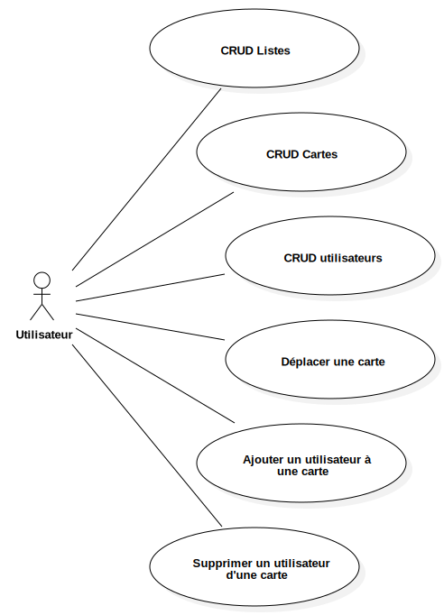

# Exercice 1

Trello board

# Brief

Pour la création d'un application Trello like, j'ai besoin d'une API et une base de donnée pour la persistence des données.

Par soucis de simplicité, l'application ne présentera qu'un seul board. L'application sera donc un board unique.

## User stories

* *U = utilisateur*

1. En tant qu'U, je veux créer des listes afin de représenter l'évolution du travail en cours

2. En tant qu'U, je veux modifier une liste afin de corriger une erreur de naming

3. En tant qu'U, je veux supprimer une liste afin de nettoyer mon board

4. En tant qu'U, je veux créer des cartes afin de partager un exercice ou une compétence à acquerir

5. En tant qu'U, je veux modifier une carte afin de corriger une erreur de naming

6. En tant qu'U, je veux supprimer une carte afin de nettoyer mon board

7. En tant qu'U, je veux créer des utilisateurs afin de leur attribuer un exercice ou une compétence à acquerir

8. En tant qu'U, je veux modifier un utilisateur afin de corriger une erreur de naming

9. En tant qu'U, je veux supprimer un utilisateur afin de nettoyer le board

10. en tant qu'U, je veux déplacer une carte d'une liste à une autre afin de montrer l'évolution du travail en cours

11. en tant qu'U, je veux ajouter un user à une carte afin de lui attribuer l'exercice ou la compétence

12. en tant qu'U, je veux supprimer un user d'une carte afin de corriger une erreur d'attribution

13. en tant qu'U, je veux voir mon board avec les cartes et les users associés en un coup d'oeil afin d'avoir un vision condensée de l'évolution du travail en cours

## Use case diagram



# Modelisation des données

## Étape 1

### Déduire des entités de données en jeu dans cette application

## Étape 2

### Déduire les associations entre les entités

## Étape 3

### Établir les type d'associations entre les entités (cardinalités)

## Étape 4

### Créer le diagramme de classe UML

Dans ce diagrammes, doit figurer :
* les entités
* les associations
* les cardinalités

*L'outil préconnisé est starUML.*

## Étape 5

### En déduire les tables à créer dans la future base de données relationnelle.

Vous devrez specifier les clés primaires et étrangères et les eventuelles tables de jointure.

*Indice : Dans un contexte de base de données relationnelles, pour les relations "many to many", il faut créer une table de jointure.*

## Étape 6

### Afin de mettre à l'épreuve votre modèle de donnée, vous devez créer la base de données avec votre SGBD préféré.

## Étape 7

### Vous pouvez à présent créer les requête SQL qui serviront dans l'APPLICATION SERVER finale en vous appuyant sur les user stories ou les use cases.

Ecrire les requêtes SQL pour :

* Afficher le nom de la liste dans laquelle se trouve la carte 3

solution 1 (avec sous-requêtes):

```
SELECT name FROM lists WHERE id = ( SELECT list_id FROM cards WHERE id = 3)
```

solution 2 (avec alias):

```
SELECT * FROM cards as c JOIN lists as l ON l.id = c.list_id WHERE c.id = 3
```

* Afficher toutes les cards de la list qui a l'id 3
* Afficher toutes les cards du user qui a l'id 1
* Afficher toutes les users associés à la card qui a l'id 2
* Afficher les lists avec leurs cards associées
* Afficher les lists avec pour chacune les cards et pour chaque cards les users associés
